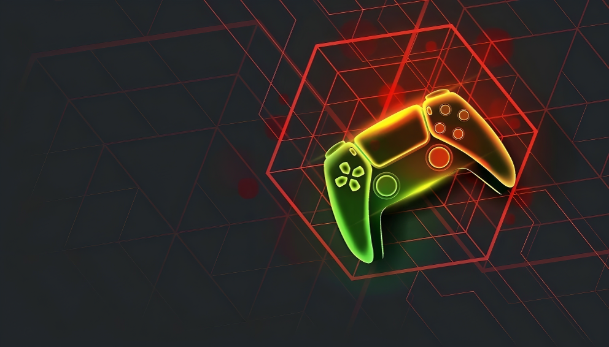

# RobleGames ✨

   
  <!-- Badge para Watchers -->
  

  <!-- Badge para Stars -->
  

**RobleGames** es una colección de juegos de navegador creados por RobleUY (@robleuy) que pueden ser jugados **sin conexión a Internet**. Están desarrollados utilizando **HTML**, **CSS** y **JavaScript**, lo que permite ejecutarlos directamente en tu navegador sin necesidad de instalación ni conexión activa.

## 🌟 Características

- **Juegos sin conexión**: Todos los juegos de RobleGames se pueden jugar sin conexión a Internet. Solo necesitas un navegador web para disfrutarlos.
- **Ligero y rápido**: Los juegos están diseñados para ser ligeros y rápidos.
- **Peso del instalador**: Aproximadamente 10 MB

## 🚀 Juegos actuales

1. **DISPARALIENS**  
   **Género**: Acción / Espacial / Supervivencia  
   **Sobre el juego**: En **DISPARALIENS**, los jugadores deben elegir un mapa y una nave para enfrentarse a una invasión alienígena. El objetivo es eliminar a las naves enemigas mientras evitas que te dañen.

2. **ROBASTEROIDE**  
   **Género**: Acción / Espacial / Supervivencia  
   **Sobre el juego**: En **ROBASTEROIDE**, te adentrarás en el espacio exterior y deberás destruir cuantos asteroides puedas para conseguir el puntaje más alto posible.

## 🌌 Próximos juegos

RobleGames está en constante expansión y se agregarán más juegos a la colección. ¡Mantente atento a las actualizaciones!

## 📝 Instrucciones de uso

1. Descarga el instalador. **[Haz clic para descargar ahora](https://github.com/Fede55xd/RobleGames/releases/download/RobleGames/v1.0_RobleGames.Setup.exe)**
2. Instala el programa y habilita la opción de crear un acceso directo en el escritorio.
3. Ingresa al acceso directo **RobleGames**.
4. Selecciona un juego y disfruta de la experiencia.

## 💻 Requisitos

- Un navegador web. Ejemplo: Chrome, Brave, Firefox, Opera.
- No se requiere conexión a Internet para jugar.

## 🤝 Contribuciones

¡Las contribuciones son bienvenidas! Si deseas agregar nuevas características o juegos, por favor, abre un *issue* o envía un *pull request*. Estaré encantado de revisar tus aportes.

## 📱 Contacto

Si tienes alguna duda o sugerencia, no dudes en contactarme a través de mi **[Instagram](https://instagram.com/robleuy)** o a través de los *issues* del repositorio.

---

¡Diviértete jugando! 🎮🚀
